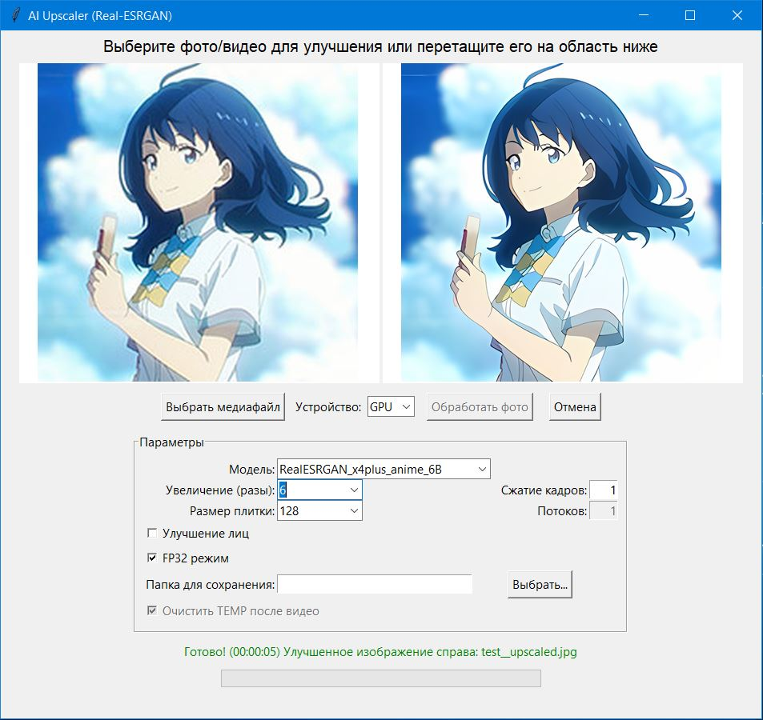

# 🖼️ AI Upscaler GUI (на основе Real-ESRGAN)

Многофункциональное десктопное приложение с графическим интерфейсом (GUI) для апскейлинга изображений и видео с помощью нейросетей [Real-ESRGAN](https://github.com/xinntao/Real-ESRGAN).



---

## 🔧 Основные возможности

- ✅ Улучшение (апскейлинг) изображений и видео
- ✅ Поддержка работы как на **GPU (CUDA)**, так и на **CPU**
- ✅ Поддержка drag-and-drop интерфейса
- ✅ Предпросмотр результата (до/после)
- ✅ Выбор:
  - модели
  - масштабирования (×1–×8)
  - плитки (tile)
  - face enhancement
  - режима FP32
- ✅ Автоматический подбор размера плитки в зависимости от объема видеопамяти
- ✅ Параллельная обработка кадров видео с отображением ETA
- ✅ Поддержка отмены процесса и очистки временных файлов (TEMP)
- ✅ Настраиваемая папка сохранения результата
- ✅ Автоматическая установка нужных компонентов:
  - Python 3.10
  - Git-клонирование Real-ESRGAN
  - Torch и зависимости в отдельном виртуальном окружении

---

## 🧠 Поддерживаемые модели

| Название модели | Описание |
|------------------|----------|
| `RealESRGAN_x4plus` | Универсальная модель апскейлинга |
| `RealESRNet_x4plus` | Более быстрая, менее агрессивная модель |
| `RealESRGAN_x4plus_anime_6B` | Специализирована на аниме |
| `RealESRGAN_x2plus` | Масштабирование ×2, экономит ресурсы |
| `realesr-animevideov3` | Оптимизирована для видео-аниме |
| `realesr-general-x4v3` | Универсальная модель с улучшенным качеством и скоростью |

---

## ⚙️ Системные требования

|                         | Минимум                          | Рекомендуется                     |
|-------------------------|----------------------------------|-----------------------------------|
| ОС                      | Windows 10 / Linux / macOS       | Windows 11 64-bit                 |
| CPU                     | Intel Core i3 / AMD Ryzen 3      | Intel i5 / Ryzen 5 и выше         |
| RAM                     | 8 ГБ                             | 8–16 ГБ                           |
| GPU (опционально)       | —                                | NVIDIA GTX 1060 или лучше (CUDA)  |
| Python                  | 3.10.x                           | 3.10.11                           |
| Свободное место на диске| 5–6 ГБ                           | 12+ ГБ (для видеофайлов)          |
| Необходимое ПО          | Установленный [Git](https://git-scm.com/downloads)                   |

---

## 📦 Установка и запуск

### 1. Клонируйте репозиторий

```bash
git clone https://github.com/yourusername/AI-Upscaler-GUI.git
cd AI-Upscaler-GUI
```

### 2. Запустите GUI

```bash
python AI_upscale_GUI.py
```

⚠️ **Если Python 3.10 не найден, скрипт предложит загрузить и установить его автоматически.**  
⚠️ Все зависимости устанавливаются **в отдельное виртуальное окружение внутри папки `Real-ESRGAN/venv`**.  
❗ Это **не влияет на глобальные библиотеки вашей системы**.

---

## 📚 Как пользоваться

1. Перетащите изображение или видео в окно программы **или** нажмите **«Выбрать медиафайл»**
2. Настройте параметры обработки:
   - модель (см. [Краткий обзор моделей (PDF)](assets/Краткий%20обзор%20моделей.pdf))
   - масштаб
   - улучшение лиц (face enhancement)
   - tile size (оптимизируется автоматически, в зависимости от количества VRAM)
   - режим работы: GPU или CPU
3. Нажмите кнопку **«Обработать»**
4. По завершении результат отобразится в правой части окна и сохранится в папку `output/` (или выбранную вами)

---

## 📷 Скриншоты

| До | После |
|----|-------|
|  |  |

---

## 📦 Создание `.exe` файла (опционально)

Если хотите собрать приложение в единый `.exe` файл для Windows:

```bash
pip install pyinstaller
pyinstaller --noconsole --onefile AI_upscale_GUI.py
```

Файл появится в папке `dist/`.

---

## 📁 Структура проекта

```
AI-Upscaler-GUI/
├── AI_upscale_GUI.py          # основной скрипт GUI
├── Real-ESRGAN/                 # автоматическое клонирование из GitHub
├── requirements.txt             # зависимости для GUI
├── README.md                    # этот файл
├── .gitignore
├── LICENSE
└── assets/                      # скриншоты для документации, обзор моделей
```

---

## 🛠 Под капотом

- Используется [TkinterDnD2](https://pypi.org/project/tkinterdnd2/) для drag & drop
- Обработка видео кадров — через `OpenCV`, `ThreadPoolExecutor` и `FFmpeg`
- Масштабирование — через `Real-ESRGAN` + `Torch` (CPU или CUDA)
- Создание виртуального окружения и установка всех зависимостей происходит автоматически

---

## 📄 Лицензия

Этот проект распространяется по лицензии MIT. См. файл [LICENSE](LICENSE) для подробностей.

---

## 🙏 Благодарности

- [xinntao/Real-ESRGAN](https://github.com/xinntao/Real-ESRGAN)
- OpenCV, Pillow, PyTorch, TkinterDnD2
- Всем разработчикам open-source решений
